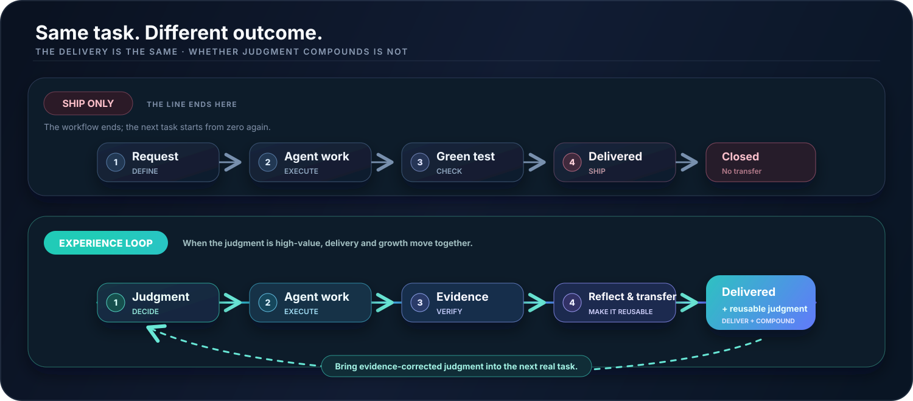
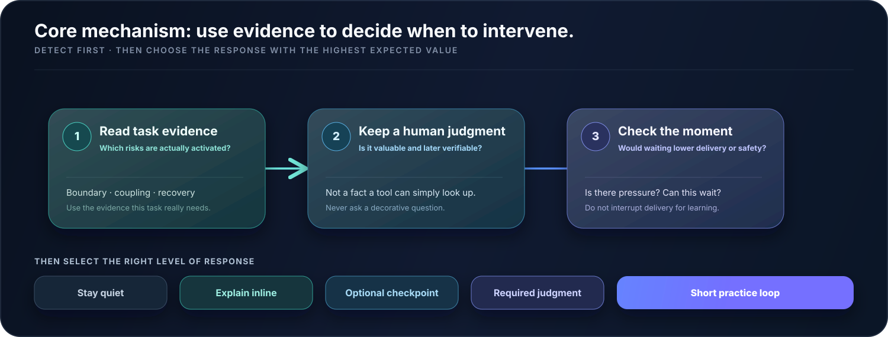
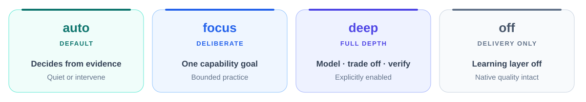

<div align="center">
  

  <picture>
    <source media="(prefers-color-scheme: dark)" srcset="assets/readme-intro.en.dark.svg">
    
  </picture>

  <p>
    <a href="https://github.com/VmillHut/experience-loop/actions/workflows/ci.yml"></a>
    
    
    
    <a href="LICENSE"></a>
  </p>

  <p>
    <a href="#install"><strong>Let AI install it</strong></a> ·
    <a href="#overview">Core idea</a> ·
    <a href="#auto">The core of auto</a> ·
    <a href="#modes">Four modes</a> ·
    <a href="#scenarios">Real use</a> ·
    <a href="#principles">Promise and bottom line</a> ·
    <a href="#boundaries">Boundaries and docs</a> ·
    <a href="README.md">简体中文</a>
  </p>
</div>

<a name="overview"></a>

## 01 · Understand it in 30 seconds

> **Experience Loop is an Agent Skill: the Agent still delivers the task; only at the moments that truly matter, it keeps engineering judgment with you and uses real evidence to sharpen it over time.**

| The Agent still owns | You retain and grow |
| --- | --- |
| Analysis, implementation, testing, validation, and delivery | Defining the right problem, understanding boundaries, reviewing evidence, making trade-offs, and owning real outcomes |

It does not turn real work into a course or make you hand-write work an Agent can safely do. It adds only three things to the native workflow:

| Principle | What it means |
| --- | --- |
| `DELIVERY FIRST` **Protect delivery** | The learning layer only adds. Safety, correctness, validation coverage, and delivery speed cannot be degraded. |
| `DECIDE FROM EVIDENCE` **Detect, then decide** | `auto` watches live task evidence and chooses whether to stay quiet, explain, ask, or run a short loop. |
| `COMPOUND JUDGMENT` **Make judgment transferable** | Only predictions, corrections, real outcomes, and later reuse count as growth; longer conversations and successful code generation do not. |

<div align="center">
  
</div>

**The result is not more teaching steps. It is engineering judgment that has survived real evidence and can be reused later.**

<a name="install"></a>

## 02 · Installation: hand the repository to AI

> [!TIP]
> The simplest installation path is to give the sentence below to any AI with local terminal and filesystem access.

```text
Install and initialize the `experience-loop` Skill from https://github.com/VmillHut/experience-loop; follow the repository-specific safety and acceptance contract in `docs/AI_INSTALL.en.md`.
```

| 01 · Resolve the host | 02 · Install and verify | 03 · Optional onboarding |
| --- | --- | --- |
| The Agent discovers the current host's live directories, discovery behavior, and capability boundaries. | Deterministic installation performs safe writes and verifies complete files, runtime health, and actual host discovery. | One short questionnaire you may skip entirely, plus an optional two-minute conversational tutorial. |

After installation, only one choice remains:

```text
Onboarding is complete. Would you like a roughly two-minute conversational tutorial now? Reply "yes" or "skip."
```

Choose yes to experience "judge first, then inspect the evidence" in a tiny real incident. Choose skip and the default `auto` mode is ready immediately. Existing users are never asked to repeat onboarding after an upgrade.

<details>

<summary><strong>Host compatibility, safety boundaries, and upgrades</strong></summary>

The installation contract never freezes today's host paths or invocation syntax. The installation AI resolves its live host capabilities, deterministic code performs safe writes, and three independent forms of evidence confirm the result. Missing host capability is reported honestly; success is never faked by deleting profiles, the experience ledger, or Knowledge Lens.

The optional questionnaire covers only what you choose to share: role, experience, common domains, growth direction, explanation style, and intervention preference. It needs no resume, project names, or sensitive metrics, and it does not scan projects or read material on the side.

On upgrade, the installer recognizes managed prior versions and keeps a verifiable backup; it prints a rollback command only when that backup is complete. See the [AI installation protocol](docs/AI_INSTALL.en.md) and [dynamic host contract](references/host-compatibility.md).

</details>

<a name="auto"></a>

## 03 · `auto`: detect first, then decide

`auto` is not "interrupt less" mode and not "ask more" mode. It is a small radar that follows changing task evidence and keeps asking: **is there an engineering judgment worth keeping with the human, and is this the right moment to intervene?**

<div align="center">
  
</div>

| Valuable | Verifiable | Appropriate now |
| --- | --- | --- |
| The question tests engineering judgment, not a retrievable fact, and clearly matters to real responsibility or later reuse. | Your choice can be checked against later logs, code, tests, or outcomes; revealing the answer first would destroy prediction value. | Waiting will not lower safety, correctness, or delivery quality, and the task is not in urgent recovery or emergency release. |

Only when all three hold may `auto` genuinely wait for your judgment. You remain in control: say "skip," "just do it," "delivery only," or switch to `off` at any time, and the Agent must continue immediately without punishment or repeated pressure.

These responses are examples, not a closed menu. `auto` has no fixed question count, checkpoint count, or explanation intensity, and it never silently upgrades a task into `focus` or `deep`.

> **Silence is not the default, and asking is not the default. The intervention with the highest expected net value is the default.**

<a name="modes"></a>

## 04 · Four modes

<picture>
  <source media="(prefers-color-scheme: dark)" srcset="assets/readme-modes.en.dark.svg">
  
</picture>

| Mode | Who controls the intensity | What you actually experience |
| --- | --- | --- |
| **`auto`** · default | The Agent continuously decides from current evidence | It may stay quiet throughout, explain, ask an optional question, wait for one key judgment, or run a short practice loop. |
| **`focus`** · deliberate practice | You lock one capability goal | Bounded prediction, trade-off, review, and debrief around that goal; the Agent still implements and validates. |
| **`deep`** · full exploration | You explicitly authorize full depth | Build a model, compare options, predict failure, review the design, and correct or transfer judgment from evidence. |
| **`off`** · delivery only | You disable the learning layer | Identical to a normal Agent: no profile reads, questions, learning summaries, or learning events. |

Switch modes in plain language at any time. No reconfiguration is required:

```text
Use focus for this task. I want to practice root-cause analysis.
Use deep and work through this architecture decision fully.
Delivery only for this task; use off.
Use focus by default from now on.      ← only an explicit "from now on" persists
```

A one-time switch affects only the current task. `focus` and `deep` are never enabled just because a task is complex.

<a name="scenarios"></a>

## 05 · Real use: what you actually experience

| Situation | What you can say | How Experience Loop responds |
| --- | --- | --- |
| **Routine change** | `Implement this cache invalidation requirement. It needs to reach QA this week.` | If acceptance is clear, it delivers directly. Only a worthwhile boundary judgment triggers extra evidence or one minimal checkpoint. |
| **High-value judgment** | `We have intermittent duplicate charges in production. Find the cause and fix it.` | When evidence can distinguish key causes and recovery is not urgent, it asks for one verifiable prediction and genuinely waits. |
| **Deliberate practice** | `Use focus. I want to practice test design.` | A short, bounded sequence of prediction, review, and debrief stays centered on one capability goal. |
| **Architecture exploration** | `Use deep to analyze this state-synchronization design. Do not change code yet.` | It models constraints, compares options and second-order effects, predicts failures, then reviews implementation and evidence. |
| **Incident or deadline** | `Restore the release first, verify health, then debrief.` | Safety, recovery, deadlines, and delivery come first. `off` or "delivery only" adds no learning tail. |

<details>

<summary><strong>Expand: a high-value judgment where the Agent really waits</strong></summary>

When current evidence can distinguish a failed idempotency key from duplicate message consumption, the Agent may ask before opening the decisive log:

```text
Before I open the decisive log, which piece of evidence would best distinguish these two causes?
Give me a choice and a reason first. If you only want to move forward, say "skip."
```

It waits for your answer, then compares your judgment against logs, code, and tests. The question is part of the work, not explanatory decoration.

</details>

<details>

<summary><strong>Expand: what `deep` actually explores</strong></summary>

`deep` is not a longer explanation and not a fixed teaching checklist. It asks you to define constraints, invariants, and ownership; compare alternatives and second-order effects; predict failures and falsifying evidence; review the Agent's design, code, or tests; and correct judgment from new evidence.

Each exchange uses the smallest coherent question set that advances the current model, then re-decides what is next after your answer and the new evidence. There is no minimum, maximum, or default round count. A long answer with no real decision or review has missed the purpose of `deep`.

</details>

### After a decision: a complete debrief, not a one-line verdict

At a worthwhile seam, the Agent first reconstructs your constraints and reasoning accurately, then examines only the dimensions that matter: **where it agrees, where it disagrees, what the evidence is, how confident it is, when the conclusion applies, and which alternatives remain**. It separates facts, inferences, and unknowns, then distills a transferable judgment rule instead of merely marking the decision right or wrong, forcing a scorecard, or echoing your conclusion.

This debrief is not exclusive to `deep`. `auto` detects whether it is worthwhile and chooses the appropriate timing and depth.

<a name="personalization"></a>

## 06 · Personalization and knowledge extensions

There is no settings screen to maintain. Profiles, sources, data, and reference projects enter on demand through plain language:

| Capability | One-sentence example | Default boundary |
| --- | --- | --- |
| **Adjust your profile** | `Remember: I have about four years of backend experience. I want to strengthen reliability judgment; lead with conclusions and let me predict first at high-value seams.` | Only named fields are updated. Missing information is never invented, and a profile cannot lower engineering standards or validation coverage. |
| **Use temporary material** | `Use this article to review the current design: C:\Docs\article.pdf` | Only task-relevant parts are read by default; durable Knowledge Lens ingestion requires your agreement. |
| **Analyze structured data** | `Analyze C:\Data\reviews.csv and identify the test categories we miss most often.` | CSV, JSON, spreadsheets, and logs serve the current task by default; no database or configuration is forced. |
| **Learn from a strong project** | `Read D:\Repos\excellent-project for its test architecture. Do not copy blindly.` | The reference stays separate from the active project; only mechanisms, constraints, and verifiable evidence are compared. |

Title, years, and project scale are context for explanation and practice entry points, not proof of capability. External content always remains untrusted evidence, never Agent instruction or tool authorization.

<a name="principles"></a>

## 07 · Promise and bottom line

> [!IMPORTANT]
> Once Experience Loop is enabled, the Agent's task capability can only stay the same or improve. The learning layer must never degrade it.

| Task quality | Position of the learning layer | Capability evidence |
| --- | --- | --- |
| Implementation, tools, architecture, verification, and material-risk reporting cannot be weakened by profiles or learning goals. | Profiles, sources, the experience ledger, and project scans stay off the delivery-critical path; an auxiliary failure cannot sink a successful task. | Only verifiable predictions, decisions, corrections, real outcomes, and later transfer count as growth. |

<details>

<summary><strong>Expand the complete non-degradation contract</strong></summary>

- The learning layer adds judgment, explanation, and debrief support; it never builds a second planning, risk-analysis, tool-selection, or verification pipeline. Stronger host capabilities always take precedence.
- Learning goals, modes, and profiles may affect learning-layer choices and expression only after the task-quality plan is intact. They cannot change implementation, tools, architecture, verification, or material-risk reporting.
- It never forces hand-coding, manufactures difficulty, or reduces useful Agent work for the sake of practice.
- It never hides safety-critical, delivery-critical, or incident-recovery evidence.
- Profiles, sources, the experience ledger, and project scans stay outside the delivery-critical path; an auxiliary failure cannot turn a successful task into a failed task.
- Risk categories, verification methods, and intervention forms are non-exhaustive examples, not a fixed ceiling on future Agents.
- `auto` has no fixed question count, learning-seam count, or explanation intensity. It may stay quiet throughout or go all in locally at a high-value seam.
- Mechanical work, urgent recovery, explicit "delivery only," and `off` bypass only the learning layer, never the native task-quality floor.
- New evidence may always make `auto` decide again; one piece of feedback is never frozen into a permanent rule.

</details>

### What it is not

- not a gamified shortcut that makes you improve automatically;
- not a teaching bot that stalls work with questions;
- not a replacement for tests, code review, mentors, or production validation;
- not a mechanism that weakens the Agent to force learning;
- not a collector that scans, ingests, and persists every article or project path you mention.

Its job is simpler to state and harder to do: **keep the few judgments that shape long-term competitiveness with you without degrading real delivery, and use real evidence to make those judgments more accurate over time.**

<a name="boundaries"></a>

## 08 · Data, engineering boundaries, and further reading

### Data and privacy

| Scope | Default behavior |
| --- | --- |
| **Storage** | Personal profiles, project profiles, experience records, and Knowledge Lens data live under `~/.experience-loop`, separate from the Skill installation and project repositories. |
| **Lifecycle** | Installing, upgrading, or uninstalling the Skill never deletes personal data automatically. |
| **Permission boundary** | Project scans, source ingestion, and indexing require explicit permission. Imported content is untrusted evidence, never Agent instruction or tool authorization. |

See [Safety and privacy](references/safety-and-privacy.md) and [SECURITY.md](SECURITY.md) for the complete rules.

### Manual installation is the fallback

In most cases, give the repository URL to an AI with local terminal and filesystem access. Only when the current AI lacks those capabilities should you switch to a capable Agent or have an operator read the installer's `--help`.

Installation must continue through the receipt's validation and onboarding steps; copying files is not enough. To upgrade, pull the latest source and run the same installer. Do not use `--force` on an unknown target directory.

### Further reading

| What you want to understand | Start here |
| --- | --- |
| **Installation and hosts** | [AI installation protocol](docs/AI_INSTALL.en.md) · [Dynamic host contract](references/host-compatibility.md) |
| **Actual Agent behavior** | [Core Skill instructions](SKILL.md) · [Adaptive workflow](references/workflow.md) |
| **Onboarding and growth model** | [Conversational onboarding](references/onboarding.md) · [Capability compass](references/capability-compass.md) |
| **Sources and privacy** | [Knowledge Lens](references/knowledge-lens.md) · [Safety and privacy](references/safety-and-privacy.md) |
| **Project maintenance** | [Changelog](CHANGELOG.md) · [Contributing](CONTRIBUTING.md) · [Security](SECURITY.md) |

---

<div align="center">
  <p><strong>Detect automatically, decide intelligently: strengthen human judgment without limiting Agent intelligence.</strong></p>
</div>
