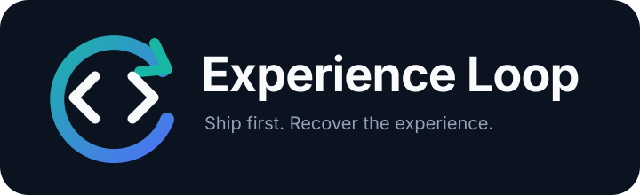
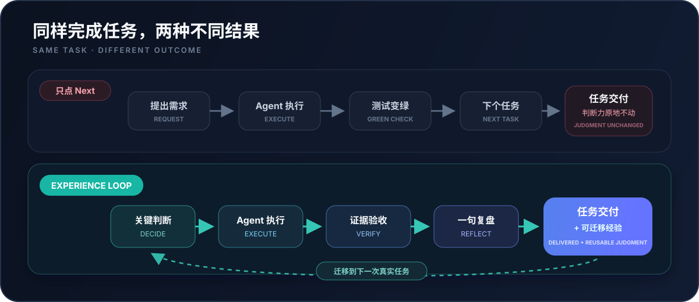

<div align="center">
  

  <p><strong>代码可以交给 Agent，判断力不能一起外包。</strong></p>
  <p>把关键决策、验收和复盘嵌回真实开发，让每次 Agent 协作都留下可迁移的工程经验。</p>

  <p>
    <a href="https://github.com/VmillHut/experience-loop/actions/workflows/ci.yml"></a>
    
    
    <a href="LICENSE"></a>
  </p>

  <p>
    <a href="#三分钟上手"><strong>立即开始</strong></a> ·
    <a href="#真实使用方式">看看怎么用</a> ·
    <a href="#knowledge-lens把书真正用进项目">接入书籍与资料</a> ·
    <a href="README.en.md">English</a>
  </p>
</div>

<br>

<div align="center">
  
</div>

## 你可能已经感觉到了

Agent 写得越来越快，但你开始很难回答：

- 为什么这次应该改这里，而不是另一层？
- 测试通过究竟证明了什么，还有什么没证明？
- Agent 给出的方案看起来都合理，应该依据什么取舍？
- 类似问题再次出现时，为什么自己还是要从头问起？

Experience Loop 不要求你少用 Agent，也不把每个任务变成一堂课。它只在真正影响结果的地方，把**判断权、验收权和复盘机会**还给你。

## 三分钟上手

需要 Python 3.9–3.14，不需要额外执行 `pip install`。

```bash
git clone https://github.com/VmillHut/experience-loop.git
cd experience-loop
python scripts/install.py
```

Windows 如果没有 `python` 命令，将最后一行换成 `py -3 scripts/install.py`。不使用 Git 也可以通过 GitHub 的 **Code → Download ZIP** 下载并解压。

安装完成后，开启一个新的 Codex 会话并说：

```text
$experience-loop setup，扫描当前项目。
我主要负责客户端开发，希望提升架构决策和代码审查能力，默认使用 ship 模式。
```

随后像平时一样交代工作：

```text
用 $experience-loop 帮我定位这次登录重连问题并修复，今天要提测。
```

不需要改项目提示词，也不需要先学一套命令。Agent 会完成初始化、项目扫描和日常调用。

## 它改变的不是执行速度，而是你的参与位置

| Agent 负责 | 你保留 | 最终留下 |
| --- | --- | --- |
| 搜索代码、修改文件、运行工具 | 对关键方案做判断 | 为什么这样选 |
| 执行测试、构建和静态检查 | 判断证据是否足够 | 什么才算验收完成 |
| 汇总日志和差异 | 审查风险与隐藏假设 | 下一次可复用的检查线索 |
| 从资料中检索相关内容 | 判断它是否适用于当前项目 | 带来源、边界和场景的知识 |

你不需要为了学习重新手写 Agent 已经能可靠完成的机械代码。人的精力应该放在架构边界、根因判断、证据选择、代码审查和最终验收上。

## 真实使用方式

### 日常开发：按时交付，同时拿回一个关键判断

```text
实现这个缓存失效需求，本周要提测。
```

默认 `ship` 模式会正常分析、修改和验证，通常只在最关键的分岔处给出一次可挑战的判断。结束时留下一个短小、可复用的工程结论，而不是输出一篇课程。

### 主动训练：先预测，再看证据

```text
这次使用 coach。我想练习根因定位，在看到决定性日志前先让我判断一次。
```

Agent 会让你做一次低成本预测，再用代码、日志或测试验证。猜错不是失败，能看清“为什么错”才是经验增长发生的地方。

### 紧急故障：先恢复，再复盘

```text
线上构建失败，使用 incident，先恢复发布。
```

处理期间不会插入教学问题。恢复和验证完成后，再用一段精简时间线解释预期、观察、差异和预防线索。

### 架构推演：把 Agent 变成审查搭档

```text
使用 deep 分析这次状态同步设计。列出方案、代价和失效条件，先不要开始改代码。
```

适合专门学习、方案评审和迁移练习，不建议在所有日常任务中开启。

## 会不会拖慢开发？

默认不会明显拖慢。`ship` 模式的学习开销被限制为 **0–1 个短检查点**；赶工时可以使用 `incident`，完全不需要学习层时可以随时切到 `off`。

| 模式 | 什么时候用 | 对工作节奏的影响 |
| --- | --- | --- |
| `ship` | 日常开发，默认模式 | 0–1 个短检查点 |
| `coach` | 想在工作中重点练一项能力 | 1–2 次预测或审查 |
| `deep` | 架构推演、专门学习 | 与你协商深度 |
| `incident` | 线上故障、构建中断 | 恢复前不教学，完成后复盘 |
| `off` | 只想完成任务 | 不加入学习层，也不记录事件 |

你可以在任何一句需求里切换模式，不需要重新 setup。

## Knowledge Lens：把书真正用进项目

把资料路径交给 Agent 就够了：

```text
把 D:\Books\Designing-Data-Intensive-Applications.pdf 加入 Knowledge Lens，
绑定当前项目。以后涉及一致性和事件设计时，结合原文证据讲解。
```

```text
你的书籍 / 设计文档 / 技术笔记
              ↓
       本地解析与建立索引
              ↓
     遇到真实工程决策时检索
              ↓
 原文依据 + 当前代码 + Agent 推断边界
              ↓
        可执行的项目建议
```

它不会每次重读整本书，也不会只生成一份脱离场景的摘要。资料会在具体问题出现时被检索，并映射到当前项目的代码、约束和验证方式。

当前支持 Markdown、纯文本、reStructuredText、HTML、EPUB、DOCX 和带文本层的 PDF。扫描型 PDF 需要先经过 OCR。

## 适合谁

Experience Loop 当前专注程序员，尤其适合：

- 入行时就开始大量使用 Codex、Claude Code 等 Agent，希望补回工程基本功的人；
- 能完成任务，但希望加强架构、调试、审查和验收能力的开发者；
- 不想脱离项目单独“上课”，希望从真实工期中持续学习的人；
- 有技术书、设计文档或团队资料，希望真正应用到代码决策中的人。

它不是自动成长外挂，也不能替代测试、代码审查、导师或生产验证。它做的是让真实工作重新产生可被你吸收的经验。

## 常见操作

<details>
<summary><strong>升级、检查状态和卸载</strong></summary>

拉取最新代码或重新下载仓库后，再次运行：

```bash
python scripts/install.py
```

安装器会保留可识别的旧版本备份，并打印状态检查、回滚和卸载所需的绝对命令。常用诊断入口：

```bash
python scripts/experience_loop.py doctor
python scripts/experience_loop.py status
```

卸载 Skill 不会同时删除个人画像和资料库；需要删除数据时，应先确认实际的数据目录。

</details>

<details>
<summary><strong>迁移到另一台电脑</strong></summary>

导出个人画像、项目档案、经验记录和 Knowledge Lens 索引：

```bash
python scripts/experience_loop.py export experience-loop-backup.experience-loop-export.zip
```

迁移包可能包含个人信息和项目线索，应当像私人备份一样保存，不要直接发布到公开仓库。

</details>

<details>
<summary><strong>它在本地保存什么</strong></summary>

个人画像、项目档案、经验记录和资料索引默认放在 `~/.experience-loop`。Skill 更新不会覆盖这些内容。详细的数据、安全、引用和删除边界见 [安全与隐私说明](references/safety-and-privacy.md)。

</details>

## 想深入了解

- [Skill 工作指令](SKILL.md)：Agent 实际遵循的核心流程
- [学习循环与模式](references/workflow.md)：检查点、验收与复盘策略
- [Knowledge Lens](references/knowledge-lens.md)：资料导入、检索和引用机制
- [版本变化](CHANGELOG.md) · [参与贡献](CONTRIBUTING.md) · [安全报告](SECURITY.md)

---

<div align="center">
  <p><strong>完成任务只是一次交付；理解为什么，才会变成你的能力。</strong></p>
  <p><a href="#三分钟上手">开始拿回被 Agent 吃掉的经验值</a></p>
</div>
