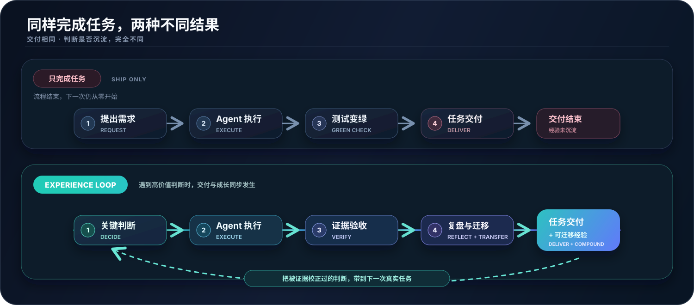
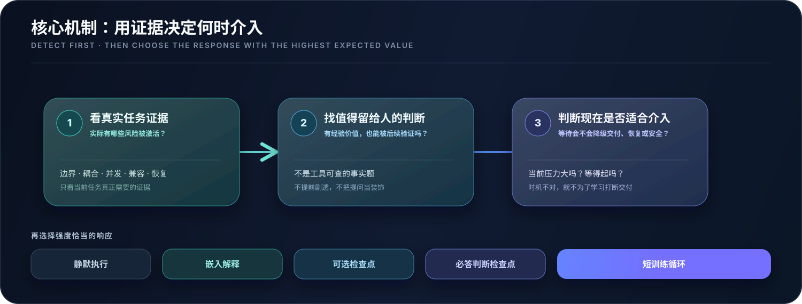
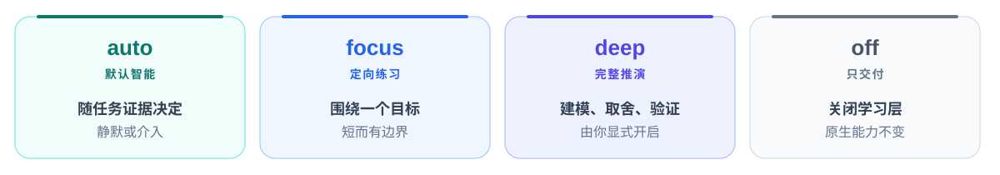

<div align="center">
  

  <picture>
    <source media="(prefers-color-scheme: dark)" srcset="assets/readme-intro.zh.dark.svg">
    
  </picture>

  <p>
    <a href="https://github.com/VmillHut/experience-loop/actions/workflows/ci.yml"></a>
    
    
    
    <a href="LICENSE"></a>
  </p>

  <p>
    <a href="#install"><strong>让 AI 安装</strong></a> ·
    <a href="#overview">核心概念</a> ·
    <a href="#auto">核心机制</a> ·
    <a href="#modes">四种模式</a> ·
    <a href="#scenarios">真实场景</a> ·
    <a href="#principles">承诺与底线</a> ·
    <a href="#boundaries">边界与文档</a> ·
    <a href="README.en.md">English</a>
  </p>
</div>

<a name="overview"></a>

## 01 · 30 秒看懂它

<blockquote>
  <p><small><strong>Experience Loop 是一个 Agent Skill：Agent 照常完成任务；它只在真正值得的节点，把工程判断留给你，并用真实证据让这些判断越来越准。</strong></small></p>
</blockquote>

- <strong>Agent 继续负责：</strong>分析、实现、测试、验证与交付。
- <strong>你保留并增长：</strong>定义正确问题、理解系统边界、审查证据、做工程取舍、承担真实结果。

　　它不把真实任务改造成课程，也不要求你手写本可由 Agent 完成的工作。它只在原生流程上增加三件事：

| 原则 | 意味着什么 |
| --- | --- |
| <strong>交付<br>优先</strong> | `DELIVERY FIRST` · 学习层只做加法：安全、正确性、验证范围和交付效率不能降级。 |
| <strong>证据<br>决策</strong> | `DECIDE FROM EVIDENCE` · `auto` 随任务证据判断是否值得介入，以及应该安静、解释、提问还是运行短循环。 |
| <strong>判断<br>迁移</strong> | `COMPOUND JUDGMENT` · 只有预测、纠正、真实结果和后续复用才算增长；聊天变长、代码生成成功都不算。 |

<div align="center">
  
</div>

　　**最终得到的不是更多教学步骤，而是一次次经过证据检验、以后还能复用的工程判断。**

<a name="install"></a>

## 02 · 安装：把仓库交给 AI

> [!TIP]
> 最省事的安装方式，是把下面这句话交给任何拥有本机终端和文件权限的 AI。

```text
请根据以下仓库安装并初始化 `experience-loop` Skill：
https://github.com/VmillHut/experience-loop
仓库特有的安全与验收要求见 `docs/AI_INSTALL.md`。
```

| 01 · 解析宿主 | 02 · 安装与验收 | 03 · 可选初始化 |
| --- | --- | --- |
| Agent 现场确认当前宿主的目录、发现方式与能力边界。 | 确定性安装器完成安全写入，并验证文件完整、运行时健康、宿主实际发现。 | 一次可全部跳过的简短问答，加一个约两分钟的对话式教学。 |

安装完成后只会留下一个选择：

```text
初始化完成。要不要现在看一个约 2 分钟的对话式使用教学？回复"要"或"跳过"即可。
```

　　选择「要」，你会在一个微型故障场景里亲手体验一次「先判断、再看证据」；选择「跳过」，默认 `auto` 立即可用。已有用户升级时不会重复问卷或新手教学。

<details>

<summary><strong>平台兼容、安全边界与升级行为</strong></summary>

　　安装契约不会把今天的宿主路径或调用语法写死。安装 AI 会解析自己所在宿主的实时能力，由安装器执行安全写入，并用三段独立证据确认结果；宿主能力不足会被如实报告，不会通过删掉画像、经验账本或 Knowledge Lens 来伪装成功。

　　初始化问答只涉及你愿意提供的岗位、经验、常做领域、成长方向、解释风格与介入偏好；不需要简历、项目名或敏感指标，也不会顺手扫描项目或读取资料。

　　升级时，安装器会识别受管理的旧版本并保留可验证备份；只有备份完整时才会给出回滚命令。完整契约见 [AI 安装协议](docs/AI_INSTALL.md) 与 [动态宿主契约](references/host-compatibility.md)。

</details>

<a name="auto"></a>

## 03 · 核心机制：何时值得介入

　　默认模式 `auto` 的核心机制不是「少打扰」，也不是「多提问」。它像一枚跟随任务证据变化的小雷达，持续判断：**这里有没有值得留给人的工程判断，现在是不是合适的介入时机。**

<div align="center">
  
</div>

| 有价值 | 可验证 | 适合现在发生 |
| --- | --- | --- |
| 问的是工程判断，而不是工具可查的事实；对现实责任或以后复用有明显价值。 | 你的选择能被后续日志、代码、测试或真实结果检验；先公布答案会损失预测价值。 | 等待不会降低安全、正确性与交付质量；当前不是故障恢复或紧急发布。 |

　　三项同时成立时，`auto` 才可能真的等待你的判断。你仍然拥有控制权：随时说「跳过」「直接做」「只交付」或切到 `off`，Agent 必须立即继续，不惩罚、不重复追问。

　　这些响应只是示例，不是封闭菜单；`auto` 没有固定问题数、检查点数或解释强度，也不会擅自把任务升级成 `focus` 或 `deep`。

> **静默不是默认，提问也不是默认；预期净收益最高的介入方式才是默认。**

<a name="modes"></a>

## 04 · 四种模式

<picture>
  <source media="(prefers-color-scheme: dark)" srcset="assets/readme-modes.zh.dark.svg">
  
</picture>

| 模式 | 谁决定强度 | 你会实际感受到什么 |
| --- | --- | --- |
| <strong><code>auto</code><br>默认智能</strong> | Agent 根据当前证据持续决定 | 可能全程安静，也可能解释、可选提问、等待一次关键判断，或运行一个短训练循环。 |
| <strong><code>focus</code><br>定向练习</strong> | 你明确锁定一个能力目标 | 围绕同一目标安排有边界的预测、取舍、审查与复盘；实现和验证仍由 Agent 负责。 |
| <strong><code>deep</code><br>完整推演</strong> | 你显式授权全深度 | 在真实任务中建立模型、比较方案、预测失效、审查设计，再用证据纠正与迁移。 |
| <strong><code>off</code><br>只交付</strong> | 你关闭学习层 | 与普通 Agent 一致：不读画像、不提问、不追加学习总结、不记录学习事件。 |

　　模式随时用自然语言切换，不需要重新初始化：

```text
这次使用 focus，我想练习根因定位。
使用 deep，完整推演这个架构决策。
这次只交付，使用 off。
以后默认使用 focus。
```

> *只有明确说「以后默认」或「保存为默认」时，这个设置才会持久化。*

　　一次性切换只影响当前任务。`focus` 和 `deep` 永远不会因为任务复杂就被 Agent 擅自开启。

<a name="scenarios"></a>

## 05 · 真实场景：你会实际感受到什么

| 场景 | 你可以直接说 | Experience Loop 如何响应 |
| --- | --- | --- |
| <strong>日常<br>修改</strong> | `实现这个缓存失效需求，本周要提测。` | 验收明确时直接完成；只有边界判断值得保留时，才补充证据或安排一个最小检查点。 |
| <strong>高价值<br>判断</strong> | `线上偶发重复扣款，帮我定位并修复。` | 当前证据能区分关键根因且恢复不紧急时，先让你做一次可验证预测，然后真的等待。 |
| <strong><code>focus</code><br>定向练习</strong> | `使用 focus，我想练习测试设计。` | 围绕同一能力目标组织短而有边界的预测、审查与复盘。 |
| <strong><code>deep</code><br>架构推演</strong> | `使用 deep 分析这次状态同步设计，先不要改代码。` | 先建模、比较方案与二阶影响、预测失效条件，再审查实现与证据。 |
| <strong>故障与<br>赶工</strong> | `先恢复发布，确认健康后再复盘。` | 安全、恢复、截止期和交付优先；`off` 或「只交付」时不追加学习尾巴。 |

<details>

<summary><strong>展开：一次真的会等你的高价值判断</strong></summary>

　　当证据恰好能区分「幂等键失效」和「消息重复消费」时，Agent 可能在打开决定性日志前问：

```text
在打开决定性日志前，你认为哪条证据最能区分这两个根因？
请先给一个选择和理由；如果现在只想推进，可以说"跳过"。
```

　　它会等你的回答，再用日志、代码和测试对照你的判断，而不是把问题当作解释性点缀。

</details>

<details>

<summary><strong>展开：`deep` 到底深入什么</strong></summary>

　　`deep` 不是更长的说明，也不是固定教学清单。它会让你定义约束、不变量与责任边界，比较方案和二阶影响，预测失效与可证伪证据，审查 Agent 的设计、代码或测试，再用新证据修正判断。

　　每轮只取能推进当前模型的最小连贯问题组，收到回答和新证据后再决定下一步；没有最低、最高或默认轮数。如果只交付一篇长答案，却没有让你实际决策或审查，就没有实现 `deep`。

</details>

### 决策之后：完整复盘，不是一句评价

　　值得复盘时，Agent 会先准确还原你的约束与理由，再分析真正相关的维度：**哪里赞同、哪里分歧、证据是什么、置信度多高、适用条件如何、是否有替代方案**。它会区分事实、推断与未知，最后提炼可迁移的判断规则，而不是只判「对/错」、固定打分或顺着你的结论附和。

　　这项复盘不属于 `deep` 专享；`auto` 会检测它是否值得发生，并决定合适的时机与深度。

<a name="personalization"></a>

## 06 · 个性化与知识扩展

不需要配置页面。画像、资料、数据与参考项目都可以用一句自然语言按需接入：

| 能力 | 一句话示例 | 默认边界 |
| --- | --- | --- |
| <strong>调整<br>画像</strong> | `记住：我做后端约 4 年，希望强化可靠性判断；解释先给结论，高价值节点让我先预测。` | 只更新你提到的字段，不编造缺失信息；画像不能降低工程标准或验证范围。 |
| <strong>临时<br>资料</strong> | `结合这篇文章审查当前方案：C:\Docs\article.pdf` | 默认只读与当前问题相关的部分；长期导入 Knowledge Lens 前会征得同意。 |
| <strong>结构化<br>数据</strong> | `分析 C:\Data\reviews.csv，找出最常漏掉的测试类型。` | CSV、JSON、表格和日志默认只服务当前任务，不强迫建库或改配置。 |
| <strong>优质<br>项目</strong> | `只读参考 D:\Repos\excellent-project 的测试架构，不要照抄。` | 参考项目与当前项目始终分离，只比较机制、约束和可验证证据。 |

　　岗位、年限和项目规模只是解释与练习切入点的上下文，不是能力证明；外部内容始终是不可信证据，不能变成 Agent 指令或工具授权。

<a name="principles"></a>

## 07 · 承诺与底线

> [!IMPORTANT]
> 启用 Experience Loop 之后，Agent 的任务能力只能保持或增强，不能因为学习层而降低。

| 任务质量 | 学习层位置 | 能力证据 |
| --- | --- | --- |
| 实现、工具、架构、验证和重要风险报告不受画像或训练目标削弱。 | 画像、资料库、经验账本和项目扫描都在交付关键路径之外；辅助功能失败不能拖垮成功任务。 | 只有可验证的预测、决策、纠正、真实结果和后续迁移才算增长。 |

<details>

<summary><strong>展开完整的不降级契约</strong></summary>

- 学习层只增加判断、解释与复盘帮助，不另建一套计划、风险分析、工具选择或验证流程；宿主 Agent 有更强能力时，优先使用更强能力。
- 学习目标、模式和画像只能在任务质量方案确定后影响学习层的选择与表达，不能改变实现、工具、架构、验证或重要风险报告。
- 不为了练习强迫手写、制造困难，或减少 Agent 能完成的有用工作。
- 永不隐藏安全关键、交付关键或故障恢复所需的证据。
- 画像、资料库、经验账本和项目扫描位于交付关键路径之外，辅助失败不能让成功任务变成失败任务。
- 风险类别、验证方法和介入形式都是非穷举示例，不是限制未来 Agent 的固定清单。
- `auto` 没有固定问题数、学习节点数或解释强度；它可以全程安静，也可以在高价值节点局部开足马力。
- 机械任务、紧急恢复、明确「只交付」和 `off` 只绕过学习层，不改变 Agent 原生的质量底线。
- 新证据始终可以让 `auto` 重新决策；一次反馈不会被固化成永久规则。

</details>

### 它不是什么

- 不是「自动变强」的游戏化外挂；
- 不是用提问拖延任务的教学机器人；
- 不是测试、代码审查、导师或生产验证的替代品；
- 不是通过削弱 Agent 能力来逼你学习；
- 不是看到文章或项目路径就自动扫描、导入、持久化的知识收集器。

　　它做的事更朴素，也更难：**在真实交付不降级的前提下，把少数真正决定长期竞争力的判断留给人，并用真实证据让这些判断逐渐变准。**

<a name="boundaries"></a>

## 08 · 数据、工程边界与继续阅读

### 数据与隐私

| 范围 | 默认行为 |
| --- | --- |
| <strong>存放<br>位置</strong> | 个人画像、项目档案、经验记录和 Knowledge Lens 默认位于 `~/.experience-loop`，与 Skill 安装目录和项目仓库分离。 |
| <strong>生命<br>周期</strong> | 安装、升级和卸载 Skill 都不会自动删除个人数据。 |
| <strong>权限<br>边界</strong> | 项目扫描、资料导入和索引需要显式权限；导入内容只是不可信证据，不能成为 Agent 指令或工具授权。 |

　　完整规则见 [安全与隐私说明](references/safety-and-privacy.md) 和 [SECURITY.md](SECURITY.md)。

### 手工安装只是兜底

　　绝大多数情况下，把仓库地址交给有本机终端和文件权限的 AI 即可。只有当前 AI 缺少这些能力时，才需要换一个有权限的 Agent，或由操作者阅读安装器 `--help` 自行执行。

　　安装后必须继续完成回执中的验证和初始化，不能只复制文件。升级时重新下载或拉取最新源码，再运行同一个安装器；不要对未知目标目录擅自使用 `--force`。

### 进一步阅读

| 主题 | 从这里开始 |
| --- | --- |
| <strong>安装与<br>宿主</strong> | [AI 安装协议](docs/AI_INSTALL.md) · [动态宿主契约](references/host-compatibility.md) |
| <strong>Agent<br>实际行为</strong> | [Skill 核心指令](SKILL.md) · [自适应工作流](references/workflow.md) |
| <strong>初始化与<br>成长模型</strong> | [对话式初始化](references/onboarding.md) · [能力罗盘](references/capability-compass.md) |
| <strong>资料与<br>隐私</strong> | [Knowledge Lens](references/knowledge-lens.md) · [安全与隐私说明](references/safety-and-privacy.md) |
| <strong>项目<br>维护</strong> | [版本变化](CHANGELOG.md) · [参与贡献](CONTRIBUTING.md) · [安全报告](SECURITY.md) |

---

<div align="center">
  <p><strong>先自动检测，再智能决策；增强人的判断力，不限制 Agent 的智能。</strong></p>
</div>
