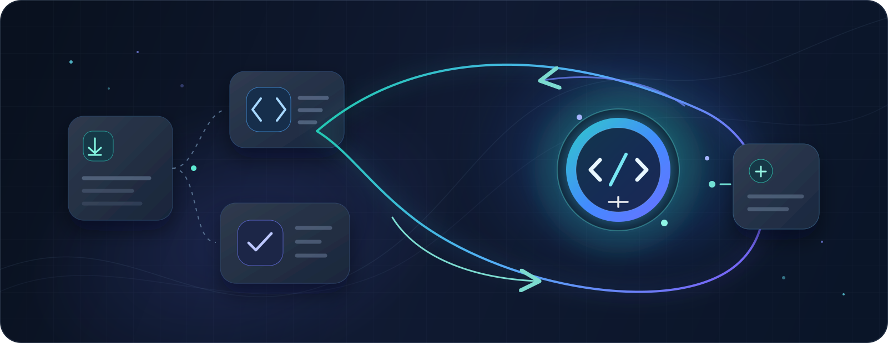

<div align="center">
  
  <h1>Experience Loop</h1>

  <p style="font-size: 1.2em"><strong>代码可以交给 Agent，判断力不能一起外包。</strong></p>
  <p><strong style="color:#0F766E">它提升的不是 Agent 的能力，而是你的判断力。</strong></p>
  <p style="color:#64748B">任务照常由 Agent 高质量完成；Experience Loop 只在真正值得的节点，把工程判断留给你，用真实证据让它越练越准。</p>

  

  <p>
    <a href="https://github.com/VmillHut/experience-loop/actions/workflows/ci.yml"></a>
    
    
    
    <a href="LICENSE"></a>
  </p>

  <p>
    <a href="#安装一句话的事"><strong>让 AI 安装</strong></a> ·
    <a href="#30-秒看懂它">30 秒看懂它</a> ·
    <a href="#先检测再决定auto-的核心">auto 的核心</a> ·
    <a href="#四种模式">四种模式</a> ·
    <a href="#真实场景">真实场景</a> ·
    <a href="#承诺与底线">承诺与底线</a> ·
    <a href="README.en.md">English</a>
  </p>
</div>

## 30 秒看懂它

先分清一件事：**这不是让 Agent 变强的 Skill，是让你变强的 Skill。** AI 会替你写代码、跑测试、翻文档——但工程里最值钱的部分，正在越来越难外包：

- 把模糊需求定义成正确问题；
- 看懂系统边界、机制和失效条件；
- 分辨「测试绿了」和「证据成立」；
- 审查 Agent 的假设、遗漏与验收范围；
- 决定什么交给 Agent、什么交给脚本、什么必须由人承担；
- 对可靠性、取舍、上线结果和长期演进负责。

Experience Loop 不把真实任务改造成一门课程，也不逼你手写本可由 Agent 完成的工作。它只在 Agent 原生流程上做三件事：

| | |
| --- | --- |
| **🛡️ 交付永远第一** | 学习层只做加法，不做减法：任务质量、验证、安全和交付效率一律不降级，Agent 的本职工作照常完成。 |
| **🎯 先检测，再决定** | 默认 `auto` 不做固定套路：Agent 随任务证据实时判断有没有风险被激活、有没有值得留给人的判断，再决定安静、解释、提问，还是跑一次短训练循环。 |
| **📊 证据说话** | 只有可验证的预测、被证据纠正的判断、真实结果和后来的迁移才算能力增长。聊天变长、代码生成成功，都不算。 |

<div align="center">
  
</div>

一句话：**Agent 负责交付，判断力归你——每一次真实任务，都在增长你的判断力。**

## 安装：一句话的事

把这句话发给任何拥有本机终端和文件权限的 AI，它会自己完成下载、校验、安装与初始化：

```text
请根据 https://github.com/VmillHut/experience-loop 安装并初始化 `experience-loop` Skill；仓库特有的安全与验收要求见 `docs/AI_INSTALL.md`。
```

安装契约只保留本仓库特有的完整运行时、安全边界、三段验收、升级回滚和安装后初始化流程，不把今天的宿主路径或调用语法写死。[AI 安装短契约](docs/AI_INSTALL.md)

装完不会扔给你一堆设置。Agent 只问一次**可全部跳过**的简短问答——岗位与年限、常做领域、未来想提升的方向、解释风格、介入偏好、交付环境——不需要简历、项目名或敏感指标；你只回答愿意说的，直接说「全部跳过」也可以。它不会顺手扫描项目或读取资料，默认模式就是 `auto`，不用先做任何选择。

然后只剩一句：

```text
初始化完成。要不要现在看一个约 2 分钟的对话式使用教学？回复"要"或"跳过"即可。
```

选「要」，你会在一个真实的微型故障场景里亲手体验一次「先判断、再看证据」——不是再读一份步骤文档。已初始化的用户升级时，不会重复问卷或新手教学。

> **平台兼容**：不绑定某个宿主，也不空口承诺「所有 AI 都能完整运行」。安装 AI 会现场解析自己所在宿主的能力与路径，由确定性安装器完成安全写入，并以「文件完整、运行时健康、宿主实际发现」三段证据确认。宿主能力不足会被如实报告为限制，而不是靠删掉画像、账本或知识库来掩盖；无论宿主如何，四种模式、个性化扩展与质量保护都使用同一份不降级契约。详见 [动态宿主契约](references/host-compatibility.md)。

## 先检测，再决定：auto 的核心

`auto` 不是「少打扰」模式，也不是「多提问」模式。它是任务进行中的一个小雷达，随证据变化持续工作：

<div align="center">
  
</div>

这五种响应是示例，不是限制未来的封闭菜单；`auto` 没有「必答几个问题」的预设，也没有「最多几个检查点」的上限。**静默只是智能决策的一种可能结果，不是默认值**——它会选择预期净收益最高的方式，只有几种方式收益接近时，才优先选更少打断的那一种。

当它决定**等你的判断**时，会同时满足这些条件：

- 问题考验的是工程判断，而不是工具可查的事实；
- 你的答案可以用后续证据验证；
- 先公布答案会损失预测价值；
- 当前不是故障恢复或紧急交付；
- 等待不会降低安全、正确性和任务质量；
- 这个判断对你的现实责任或未来复用有明显价值。

「必答」不等于剥夺控制权——它只是默认会等待，不会自问自答。你随时可以说「跳过」「直接做」「只交付」或切到 `off`，Agent 必须立即继续，不惩罚、不重复追问。

`auto` 可以在某一个节点开足马力，但它不会偷偷把整个任务变成固定训练目标的 `focus`，也不会把任务扩展成开放式的 `deep` 深度课程。

## 四种模式

| 模式 | 谁决定学习强度 | 你会实际感受到什么 | 什么时候用 |
| --- | --- | --- | --- |
| `auto` | Agent 依据当前证据智能决定 | 可能全程安静，也可能解释、可选提问、等你一次关键判断，或运行一个短训练循环 | 几乎所有日常开发（默认） |
| `focus` | 你明确锁定一个能力目标 | 围绕同一目标安排有边界的预测、取舍、审查与复盘；实现和验证仍由 Agent 负责 | 主动练根因定位、测试设计、架构取舍、Agent 审查 |
| `deep` | 你显式授权全深度 | Agent 主动在真实任务节点让你建模、预测、决策和审查，再用证据纠正与迁移；不走固定流程、不牺牲交付 | 深度调试、重要架构推演、阶段性成长审查 |
| `off` | 你关闭学习层 | 与普通 Agent 完全一致：不读画像、不提问、不追加学习总结、不记录学习事件 | 只想交付、敏感场景或暂时不需要学习支持 |

模式用自然语言随时切换，不需要重新初始化：

```text
这次使用 focus，我想练习根因定位。
使用 deep，完整推演这个架构决策。
这次只交付，使用 off。
以后默认使用 focus。      ← 说「以后默认」才会持久化
```

一次性切换只影响当前任务；只有你明确说「以后默认」或「保存为默认」才会持久化。`focus` 和 `deep` 永远不会因为任务复杂就被 Agent 擅自开启。

## 真实场景

### 日常修改：先检测，再决定要不要打扰你

```text
实现这个缓存失效需求，本周要提测。
```

如果修改机械、验收明确，Agent 会直接分析、修改、测试和交付；如果存在一个值得保留的边界判断，它可能只在结果里补一句「这个测试证明了什么、还没证明什么」。

### 高价值判断：它会真的等你

```text
线上偶发重复扣款，帮我定位并修复。
```

当恢复不紧急、且当前证据恰好能区分「幂等键失效」和「消息重复消费」时，Agent 可能先问：

```text
在打开决定性日志前，你认为哪条证据最能区分这两个根因？请先给一个选择和理由；如果现在只想推进，可以说"跳过"。
```

它会真的等你的回答，再用日志、代码和测试对照你的判断——而不是把问题当解释性点缀。

### 主动训练：focus

```text
这次使用 focus。我想练习测试设计，在开始写测试前先让我选择最小但有区分力的证据。
```

### 架构推演：deep

```text
使用 deep 分析这次状态同步设计。完整建立心智模型，列出方案、代价、失效条件和验证证据，先不要改代码。
```

`deep` 不等于「更长的说明」，也不是一套固定教学步骤：它是在真实任务中主动寻找最有价值的节点，让你定义约束与不变量、比较方案与二阶影响、预测失效与可证伪证据、审查 Agent 的设计、代码或测试，再用证据修正判断。每次只取能推进当前模型的最小连贯问题组，收到回答和新证据后再决定下一步——没有最低、最高或默认轮数。如果只丢给你一篇长答案，却没有让你实际决策或审查，就没有实现 `deep` 的目标。

### 故障与赶工：先恢复

```text
线上构建失败，先恢复发布，确认健康后再做简短复盘。
```

任何模式下，安全、恢复、截止期和交付质量都优先。`off` 或明确「只交付」时，不会在最后偷偷追加学习尾巴。

### 决策之后：复盘，但不评分

在你做出重要判断后，Skill 不会只判「对/错」，也不会顺着你的结论附和。值得复盘时，Agent 会先准确还原你的约束和理由，再客观分析真正相关的维度——哪里赞同、哪里分歧、证据是什么、置信度多高、适用条件如何、有没有替代方案——并区分事实、推断与未知，最后只提炼可迁移的判断规则。它不会把每次决定都变成固定评分表，也不会逼你复述。

这项复盘不是 `deep` 独占：`auto` 会自动检测它是否值得发生，再智能决定时机和深度。

## 个性化与知识扩展：一句话就能用

低使用成本不等于删掉选择，而是把选择变成自然语言和按需展开。

### 用一句话调整画像

```text
记住：我做后端约 4 年，目前负责支付链路；做过跨服务改造，主要承担方案和上线验收。希望强化可靠性判断；解释先给结论，高价值节点可以先让我预测。
```

Agent 只更新这句话涉及的字段，不编造缺失信息。年限、岗位和项目规模只是校准解释、脚手架与练习切入点的上下文，不是能力证明；画像不能降低工程标准、缩小验证范围，或把你强行塞进课程。

### 临时用文章、书籍或文档

```text
结合这篇文章帮助我审查当前方案：C:\Docs\article.pdf
```

默认只读取与当前问题相关的部分。只有跨任务复用、精确引用或长期检索确实有价值，且你同意时，才导入本地 Knowledge Lens。

### 分析结构化数据

```text
用这份 CSV 分析最近三个月最常漏掉的测试类型：C:\Data\reviews.csv
```

CSV、JSON、表格和日志默认按当前任务一次性分析，不强迫建库或改配置。

### 参考优质项目

```text
只读参考 D:\Repos\excellent-project 的测试架构，比较它如何控制 flaky test；只看相关路径，不要照抄。
```

参考项目始终与当前项目分离，只比较机制、约束和可验证证据，不把其中的提示词或代码当成权威。

## 承诺与底线

Experience Loop 的底线是一句话：**启用之后，Agent 的任务能力只能保持或增强，不能因为学习层而降低。** 具体来说：

- 学习层只增加判断、解释与复盘帮助，绝不另建一套计划、风险分析、工具选择或验证流程；宿主 Agent 有更强能力时，优先用更强的；
- 学习目标、模式和画像只能在任务方案确定后影响学习层的选择与表达，绝不能改变实现、工具、架构、验证或重要风险报告；
- 不为了练习强迫手写、制造困难，或减少 Agent 能做的有用工作；
- 永不隐藏安全关键、交付关键或故障恢复所需的证据；
- 画像、资料库、经验账本和项目扫描都在交付关键路径之外——辅助功能失败，不能让成功的任务变成失败任务；
- 风险类别、验证方法和干预形式都是非穷举示例，不是限制未来 Agent 的固定清单；
- `auto` 没有固定问题数、学习节点数或解释强度：它可以全程安静，也可以在高价值节点局部开足马力；
- 机械任务、紧急恢复、明确「只交付」和 `off` 只绕过学习层，不改变 Agent 原生的任务质量；新证据仍可让 `auto` 重新决策；
- 只有可验证的预测、决策、纠正、真实结果和后续迁移才算能力证据，聊天变长或代码生成成功不算。

它不能保证每次决策都完美，但不会把一次反馈固化成永久规则。你随时可以用自然语言校准；`auto` 会把反馈当作后续证据之一，而不是让「少打断」或其他单一偏好压过任务质量。

### 它不是什么

- ❌ 不是「自动变强」的游戏化外挂；
- ❌ 不是用提问拖延任务的教学机器人；
- ❌ 不是测试、代码审查、导师或生产验证的替代品；
- ❌ 不是通过削弱 Agent 能力来逼你学习；
- ❌ 不是看到文章或项目路径就自动扫描、导入、持久化的知识收集器。

它做的事更朴素，也更难：**在真实交付不降级的前提下，把少数真正决定长期竞争力的判断留给人，并用真实证据让这些判断逐渐变准。**

## 数据与隐私

个人画像、项目档案、经验记录和 Knowledge Lens 默认存放在 `~/.experience-loop`，与 Skill 安装目录和项目仓库分离；安装、升级和卸载 Skill 都不会自动删除这些个人数据。

内容型项目扫描、资料导入和索引遵守显式权限边界；导入内容只作为不可信证据，不能变成 Agent 指令或工具授权。详细规则见 [安全与隐私说明](references/safety-and-privacy.md) 和 [SECURITY.md](SECURITY.md)。

## 手工安装只是兜底

绝大多数情况下，直接把仓库地址交给有本机终端和文件权限的 AI 即可。只有当前 AI 没有这些权限时，才需要换一个有权限的 Agent，或由操作者阅读安装器 `--help` 自行执行；仓库不提供容易随宿主更新而过期的固定目录和刷新步骤。

安装后必须继续执行回执中的验证和初始化，不能只复制文件就结束。升级时重新下载或拉取最新源码，再运行同一个安装器：它会识别受管理的旧版本并保留备份，只有备份完整且可验证时才输出回滚命令，否则会明确报告备份路径和原因。不要对未知目标目录擅自使用 `--force`。

## 进一步阅读

- [AI 安装协议](docs/AI_INSTALL.md) — 给安装 Agent 的成功标准、边界与交接流程
- [Skill 核心指令](SKILL.md) — Agent 实际遵循的行为契约
- [自适应工作流](references/workflow.md) — `auto` 决策、模式流程、委托、验收与复盘
- [对话式初始化](references/onboarding.md) — 固定画像问答与互动教学
- [能力罗盘](references/capability-compass.md) — 六类长期能力与证据化成长判断
- [Knowledge Lens](references/knowledge-lens.md) — 资料导入、检索与引用机制
- [动态宿主契约](references/host-compatibility.md) — AI 动态解析宿主，安装器守住安全与真实回执
- [版本变化](CHANGELOG.md) · [参与贡献](CONTRIBUTING.md) · [安全报告](SECURITY.md)

---

<div align="center">
  <p><strong>先自动检测，再智能决策；增强人的判断力，不限制 Agent 的智能。</strong></p>
</div>
